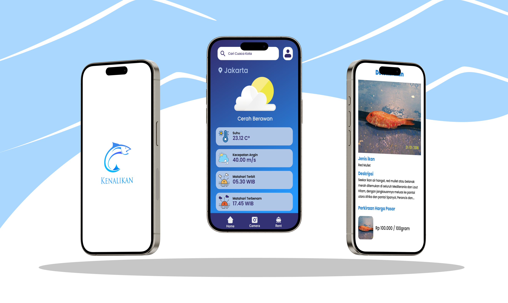

# Capstone Bangkit Academy C241-PS401
 

  

 

## Introduction
Kenalikan - Kenalikan is a mobile app for Indonesian beginners anglers, providing accurate weather and local fish data to improve fishing success and safety fishing trip.

## Project Scope & Deliverables:
### Project Goal:
- Build a mobile application (Android) that can display weather in real time, detect fish based on photo input from users and make it easier for anglers to find boat rental and fishing equipment.
### Deliverables:
- Display realtime weather features 
- Building a system that can fish detection from picture
- Helping anglers to find boat hire and fishing tackle
- Delivering user friendly, and reliable mobile application
### Scope:
### In-Scope:
- Fish detection based on the type of fish 
- Display fish description 
- Real-time weather display
### Out-of-Scope:
- Display market prices by fish type
- Create a user application to find boat and fishing equipment rental

## Our Team Member
- [(ML) M011D4KX1603  -  Athaya Salsabil  - Universitas Padjadjaran]
- [(ML) M010D4KX2055 -  Jessie   - Universitas Indonesia]
- [(ML) M295D4KY2383 - Prazka Aldiyuda  - Universitas Pembangunan Nasional Veteran Jakarta]
- [(MD) A009D4KY3771 - Adriansyah Nurrahman - Universitas Gunadarma]
- [(MD) A009D4KY3977 -  Muhamad Andis Dwi Hartanto – Universitas Gunadarma]
- [(CC) C010D4KX0055  - Najmi Anasya Calyla  - Universitas Indonesia]
- [(CC) C010D4KX0066  - Katrina Gisella Sembiring  -  Universitas Indonesia]

## Repositories
- [Kenalikan-Machine Learning](https://github.com/andisdwihartanto/Kenalikan-Bangkit-Capstone/tree/main/ML)
- [Kenalikan-API](https://github.com/andisdwihartanto/Kenalikan-Bangkit-Capstone/tree/main/CC)
- [Kenalikan-Mobile Development](https://github.com/andisdwihartanto/Kenalikan-Bangkit-Capstone/tree/main/MD/Kenalikan)
